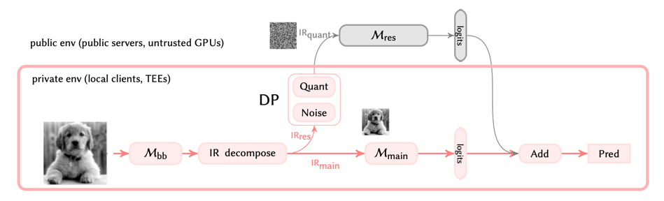

## Official codebase for Delta

---

### Overview
Private data are decompose into private and public parts.
The private part is fed to a small private model; 
the public part is perturbed and then fed to a large model in public environments (GPUs).

Therefore, privacy is protected in the private environment, 
while computing performance is achieved by leveraging fast GPUs.



---

### Environment

python=3.9  
torch=1.10  
numpy=1.21

---

### Run

```bash
bash run.sh
```

